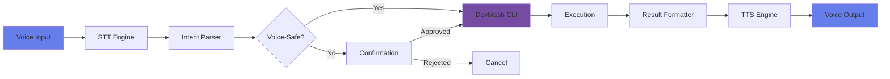

# VoiceOps Architecture

**Voice-driven development and agent control layer for DevMesh**

## Overview

VoiceOps is the voice interface layer that enables developers to control DevMesh CLI and LogicStarter agents using natural voice commands. It bridges the gap between spoken intent and executable CLI commands.

## Architecture Diagram



## System Flow

### 1. Voice Input → STT (Speech-to-Text)

**Input:** Raw audio stream or audio file
**Output:** Transcribed text with confidence score

**Supported STT Backends:**

| Backend | Type | Pros | Cons | Recommended Use |
|---------|------|------|------|-----------------|
| **Whisper** (OpenAI) | Open-source | Highly accurate, multilingual, free | Requires local compute | Primary choice |
| **Coqui STT** | Open-source | Fast, privacy-focused | Less accurate than Whisper | Privacy-critical scenarios |
| **Web Speech API** | Browser | No setup, instant | Browser-only, limited | Quick prototypes |
| **ElevenLabs** | Commercial | Premium quality | Paid API | Production (optional) |

**Implementation:**

```typescript
interface STTProvider {
  transcribe(audioBuffer: Buffer): Promise<TranscriptionResult>;
}

// Example: Whisper implementation
const whisperSTT: STTProvider = {
  async transcribe(audioBuffer) {
    // Use whisper.cpp or OpenAI API
    return {
      text: "check API health",
      confidence: 0.95,
      language: "en",
      duration: 1.2
    };
  }
};
```

### 2. Intent Parsing

**Input:** Transcribed text
**Output:** Structured command with parameters

**Parser Responsibilities:**

- Extract command intent from natural language
- Map to DevMesh CLI commands
- Extract parameters and options
- Determine if confirmation is required

**Example Mappings:**

| Voice Input | Parsed Intent | DevMesh Command |
|-------------|---------------|-----------------|
| "Check API health" | `api.health` | `ll api health` |
| "Ping the system" | `ping` | `ll ping` |
| "Show configuration" | `config.show` | `ll config show` |
| "Set API URL to localhost" | `api.setUrl` | `ll api set-url http://localhost:3000` |
| "Deploy to production" | `deploy.production` | (requires confirmation) |

**Implementation:**

```typescript
interface IntentParser {
  parse(transcript: string): Promise<IntentParseResult>;
}

const intentParser: IntentParser = {
  async parse(transcript) {
    // Simple keyword matching or ML-based NLU
    const normalized = transcript.toLowerCase();

    if (normalized.includes('health') || normalized.includes('status')) {
      return {
        intent: 'api.health',
        command: 'll',
        args: ['api', 'health'],
        options: {},
        confidence: 0.9,
        requiresConfirmation: false
      };
    }

    // More sophisticated parsing...
  }
};
```

### 3. Safety & Confirmation

**Voice-Safe Commands** (auto-execute):

- ✅ `ll ping` - Read-only verification
- ✅ `ll api health` - Read-only status check
- ✅ `ll config show` - Read-only config display
- ✅ `ll api config` - Read-only API config

**Requires Confirmation:**

- ⚠️ `ll api set-url <url>` - Modifies configuration
- ⚠️ `ll config reset` - Destructive operation
- ⚠️ Any deployment commands (future)
- ⚠️ Any file system operations (future)

**Confirmation Flow:**

```typescript
async function executeWithSafety(intent: IntentParseResult) {
  if (intent.requiresConfirmation) {
    const confirmation = await speak(
      `This will ${intent.intent}. Say "confirm" to proceed or "cancel" to abort.`
    );

    const response = await listen();

    if (!response.includes('confirm')) {
      return { success: false, message: 'Cancelled by user' };
    }
  }

  return await executeCommand(intent);
}
```

### 4. DevMesh CLI Execution

**Input:** Parsed command structure
**Output:** Execution result

**Integration Methods:**

1. **Direct Module Import** (Preferred)
   - Import DevMesh as a library
   - Call command functions directly
   - Get structured results

2. **Child Process Execution**
   - Spawn `ll` CLI as subprocess
   - Parse stdout/stderr
   - More isolated but slower

**Example:**

```typescript
import { executeCommand } from '@lovelogic/devmesh';

async function runDevMeshCommand(intent: IntentParseResult) {
  const startTime = Date.now();

  try {
    const result = await executeCommand(intent.command, intent.args, intent.options);

    return {
      success: true,
      output: result.stdout,
      duration: Date.now() - startTime
    };
  } catch (error) {
    return {
      success: false,
      output: '',
      error: error.message,
      duration: Date.now() - startTime
    };
  }
}
```

### 5. Result Formatting

**Input:** Raw execution result
**Output:** Human-friendly summary

**Formatting Rules:**

- Keep responses concise (< 20 words for voice)
- Highlight key information
- Use natural language
- Omit technical details unless requested

**Examples:**

| Raw Output | Voice-Friendly Summary |
|------------|------------------------|
| `{"status": "ok", "version": "0.1.0"}` | "API is healthy, version 0.1.0" |
| `Error: ECONNREFUSED` | "Cannot connect to API. Make sure it's running." |
| `✓ Configuration reset to defaults` | "Configuration reset successfully" |

### 6. TTS (Text-to-Speech)

**Input:** Formatted text response
**Output:** Synthesized audio

**Supported TTS Backends:**

| Backend | Type | Pros | Cons | Recommended Use |
|---------|------|------|------|-----------------|
| **Coqui TTS** | Open-source | Natural voices, free | Requires setup | Primary choice |
| **Bark** | Open-source | Very natural, multilingual | Slow generation | High-quality responses |
| **Web Speech API** | Browser | Instant, no setup | Browser-only | Quick prototypes |
| **ElevenLabs** | Commercial | Premium quality | Paid API | Production (optional) |

**Implementation:**

```typescript
interface TTSProvider {
  synthesize(text: string): Promise<SynthesisResult>;
}

const coquiTTS: TTSProvider = {
  async synthesize(text) {
    // Use Coqui TTS library
    return {
      audioBuffer: Buffer.from([/* audio data */]),
      format: 'wav',
      duration: 2.5
    };
  }
};
```

## Module Breakdown

### Core Modules

```
packages/voiceops/
├── src/
│   ├── stt/
│   │   ├── whisper.ts          # Whisper STT provider
│   │   ├── coqui-stt.ts        # Coqui STT provider
│   │   └── web-speech.ts       # Browser Web Speech API
│   ├── intent/
│   │   ├── parser.ts           # Intent parsing logic
│   │   └── patterns.ts         # Command patterns
│   ├── executor/
│   │   ├── devmesh.ts          # DevMesh CLI integration
│   │   └── safety.ts           # Safety checks & confirmation
│   ├── tts/
│   │   ├── coqui-tts.ts        # Coqui TTS provider
│   │   ├── bark.ts             # Bark TTS provider
│   │   └── web-speech.ts       # Browser Web Speech API
│   ├── session/
│   │   └── manager.ts          # Session management
│   └── types.ts                # TypeScript interfaces
```

## Integration with DevMesh

### Option 1: DevMesh Plugin

```typescript
// VoiceOps as a DevMesh plugin
const voiceOpsPlugin: PlatformPlugin = {
  name: 'voiceops',
  version: '0.1.0',
  commands: [
    {
      name: 'listen',
      description: 'Start voice listening mode',
      execute: async () => {
        await startVoiceSession();
      }
    },
    {
      name: 'configure',
      description: 'Configure voice settings',
      execute: async (args) => {
        await configureVoice(args);
      }
    }
  ],
  initialize: async () => {
    await initializeSTT();
    await initializeTTS();
  }
};

// Usage: ll voice listen
```

### Option 2: Standalone Voice Loop

```typescript
// Continuous voice interaction
async function voiceLoop() {
  const session = createSession();

  console.log('🎤 VoiceOps ready. Say "exit" to quit.');

  while (true) {
    const audio = await captureAudio();
    const transcript = await stt.transcribe(audio);

    if (transcript.text.includes('exit')) {
      await tts.synthesize('Goodbye!');
      break;
    }

    const intent = await intentParser.parse(transcript.text);
    const result = await executeWithSafety(intent);

    const summary = formatResult(result);
    await tts.synthesize(summary);

    session.commands.push({ transcript, intent, result });
  }
}
```

## Security Considerations

### 1. Command Validation

- **Whitelist Approach:** Only allow predefined voice commands
- **Confirmation Required:** For any destructive operations
- **Rate Limiting:** Prevent command spam

### 2. Audio Privacy

- **Local Processing:** Use Whisper/Coqui for on-device STT
- **No Cloud Storage:** Never store audio files in cloud
- **Session Encryption:** Encrypt session logs if persisted

### 3. Authentication

- **Voice Biometrics:** Optional speaker verification (future)
- **Session Tokens:** Require authentication before voice control
- **Timeout:** Auto-logout after inactivity

## Performance Optimization

### STT Optimization

- **Model Selection:** Use Whisper `tiny` or `base` for speed
- **Streaming:** Process audio chunks in real-time
- **VAD (Voice Activity Detection):** Only transcribe when speech detected

### TTS Optimization

- **Response Caching:** Cache common responses
- **Streaming Playback:** Start playing audio before full synthesis
- **Async Generation:** Generate audio while command executes

## Future Enhancements

### Phase 2 Features

- [ ] Multi-turn conversations
- [ ] Context awareness (remember previous commands)
- [ ] Voice-driven code editing
- [ ] Agent personality customization
- [ ] Multi-language support

### Advanced Integrations

- [ ] Integration with IDE (VS Code extension)
- [ ] Mobile app for remote voice control
- [ ] Webhook triggers for voice notifications
- [ ] Voice-based code review

## Getting Started (Future)

```bash
# Install VoiceOps
pnpm add @lovelogic/voiceops

# Configure STT/TTS
ll voice configure --stt whisper --tts coqui

# Start voice session
ll voice listen

# Or use standalone
voiceops start
```

## License

UNLICENSED - Proprietary software for LoveLogic AI
